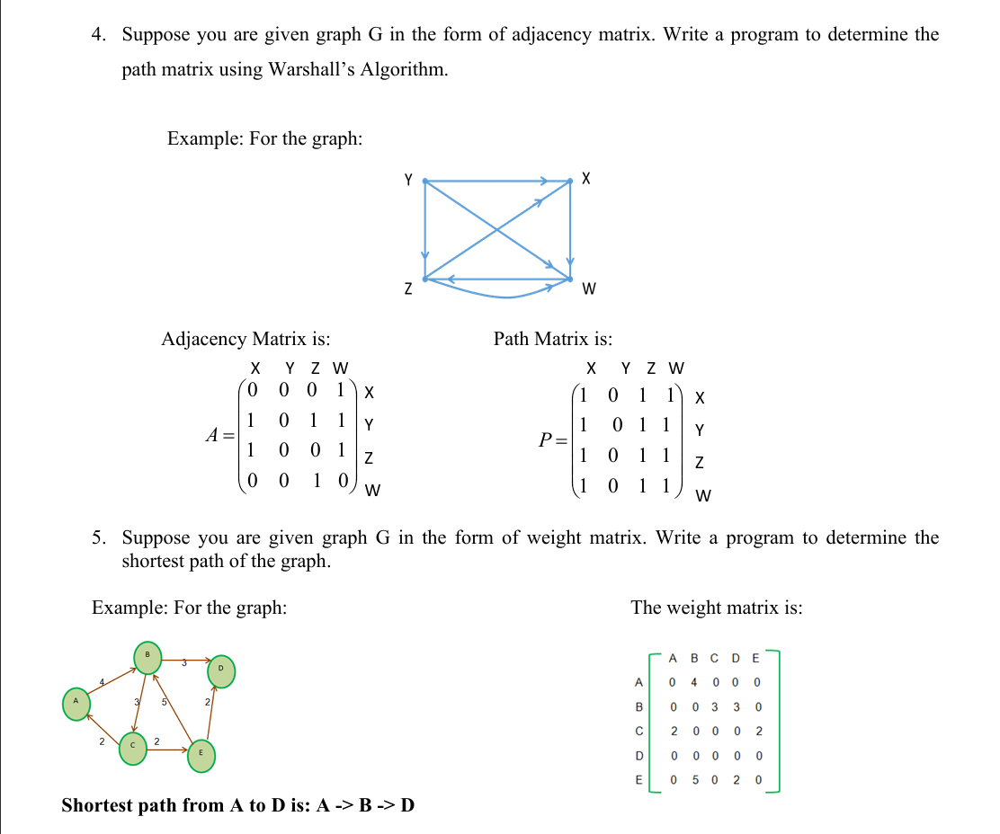

# **Assignment on Tree and Graph**

---

## **1. Binary Search Tree (BST)**

### Task:

Write a program to create a Binary Search Tree (BST) for **N given data items** as input.

👉 A binary search tree is a rooted binary tree where:

- Each internal node stores a key (and optionally an associated value).
- Each node has two subtrees: **left** and **right**.
- **BST Property**:

  - Key in each node ≥ keys in the left subtree.
  - Key in each node ≤ keys in the right subtree.

### Operations to Implement:

1. **Traverse the tree in:**

   - Pre-order
   - In-order
   - Post-order

2. **Search** the tree for a given key value.

   - Print **"Yes"** if found, otherwise **"No"**.

3. **Insert** a key into the tree at its appropriate position.

4. **Calculate the path length** of the given tree.

---

## **2. Heap Construction**

### Task:

Write a program to create a **Max Heap** and a **Min Heap** from a given unsorted array.

- **Input:** An array of `n` integers.
- **Output:**

  - The array representation of the **Max Heap**.
  - The array representation of the **Min Heap**.

### Example:

```
Input:  [3, 5, 9, 6, 8, 20, 10, 12, 18, 9]

Output (Max Heap): [20, 18, 10, 12, 9, 9, 3, 5, 6, 8]
Output (Min Heap): [3, 5, 9, 6, 8, 20, 10, 12, 18, 9]
```

---

## **3. Heap Operations (Insert/Delete)**

### Task:

Write a program to **Insert** or **Delete (root node)** in a **Max Heap**.

---

### **Insertion**

- **Input:** A Max Heap and a new integer element.
- **Output:** Print the heap before and after insertion.

**Example:**

```
Insert 25 into [20, 18, 10, 12, 9, 9, 3, 5, 6, 8]

Output: [25, 20, 10, 18, 9, 9, 3, 5, 6, 8, 12]
```

---

### **Deletion**

- **Input:** Array representation of a Max Heap.
- **Output:** Print the heap before and after deletion of the root node.

**Example:**

```
Input:  [25, 20, 10, 18, 9, 9, 3, 5, 6, 8, 12]
Output: [20, 18, 12, 6, 9, 9, 3, 5, 25, 8]
```

---


